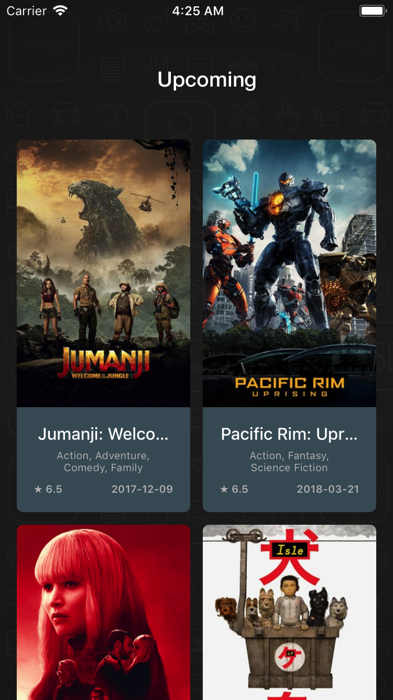
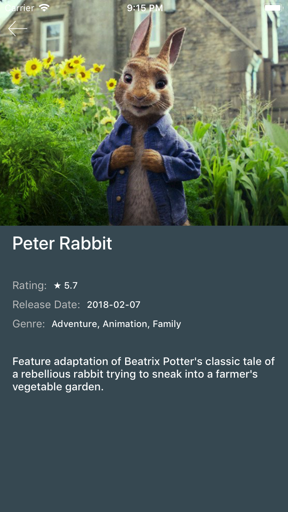
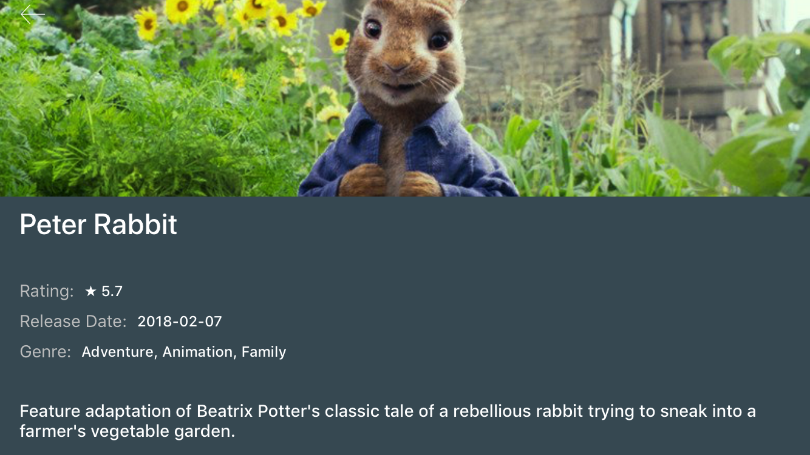

# Popcorn
App to get upcoming movies using `The Movie Database (TMDb)` as reference.

## Overview

<table>
  <tr>
    <th>
      
    </th>
    <th>
      
    </th>
    <th>
      
    </th>
  </tr>
</table>

## Development Stack

- xCode 9.2
- Swift 4
- CocoaPods as Dependency Manager
- Git Flow
- Architecture: VIPER + MVVM + Reactive (RxSwift)
- Moya + Alamofire + ObjectMapper
- No Storyboard (.xib and Programmatically)

## Third-Party libraries

- [R.swift](https://github.com/mac-cain13/R.swift) -> Used to get strong typed to resources like images, fonts and strings to avoid hardcoded strings.
- [Cartography](https://github.com/robb/Cartography) -> Allow to setup and use Auto Layout in declarative code (programmatically).
- [ParallaxHeader](https://github.com/romansorochak/ParallaxHeader) -> Add parallax header to UIScrollView or it's subclasses. Make app more elegant.
- [Kingfisher](https://github.com/onevcat/Kingfisher) -> Used to download and caching images from the web.
- [SwiftLint](https://github.com/realm/SwiftLint) -> Enforce Swift style and conventions (loosely based on GitHub's Swift Style Guide).
- [RxSwift](https://github.com/ReactiveX/RxSwift) -> Allow to use Reactive Programming to simplify the way as we build apps using asynchronous operations and event/data streams.
- [RxCocoa](https://github.com/ReactiveX/RxSwift/tree/master/RxCocoa) -> RxSwift Cocoa extensions. With this we can use `.rx` in UI components.
- [Moya](https://github.com/ivanbruel/Moya-ObjectMapper) -> Network abstraction layer to simplify network commands and operations.
- [Moya-ObjectMapper/RxSwift](https://github.com/ivanbruel/Moya-ObjectMapper) -> ObjectMapper bindings for Moya for easier JSON serialization.

## Setup
 
### Cloning

1. On GitHub, navigate to the main page of the repository.

2. Under the repository name, click **Clone or download**.

3. In the Clone with HTTPs section, click under copy icon to copy the clone URL for the repository.

4. Open Terminal.

5. Change the current working directory to the location where you want the cloned directory to be made.

6. Type `git clone`, and then paste the URL you copied in Step 2.

```
$ git clone https://github.com/marsal-silveira/Popcorn.git
```

7. Press **Enter**. Your local clone will be created.

**or**

### Downloading

1. On GitHub, navigate to the main page of the repository.

2. Under the repository name, click **Clone or download**.

3. In the Clone with HTTPs section, click under `Download Zip` button to download it.

**or**

Download the [latest code version](https://github.com/marsal-silveira/Popcorn/archive/master.zip) and extract it into workspace.

### Setup CocoaPods

We use [CocoaPods](https://guides.cocoapods.org/using/getting-started.html) as Dependecy Manager, so make sure you have this tool instaled and configured in you system.

1. Open Terminal.

2. Change the current working directory to the project directory.

3. Type `pod install`.

```
$ pod install
```

4. Wait until all dependencies are downloaded.

5. In **xCode** open project using **Popcorn.xcworkspace**.

## Author
Marsal Silveira, marsal.silveira@gmail.com

## Credits
Popcorn is a challenge implementation propose by [ArcTouch](https://arctouch.com).

App icon by [matheusgrilo](https://matheusgrilo.deviantart.com/art/Movies-and-Popcorn-Folder-Icon-441651956).

## License
Popcorn is released under an MIT license. See [License](LICENSE) for more information.
